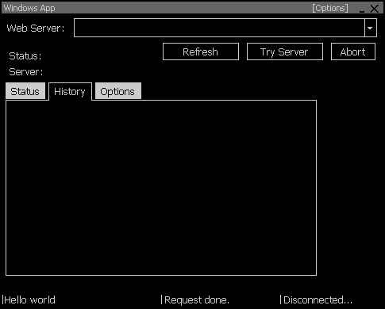

# Custom windows with the win32 API

I just happened across an old piece of code I wrote years ago, it brought back some memories. Anybody who has meticulously studied Charles Petzold's books as much as I did back in the day might find this useful. :smile:

 
